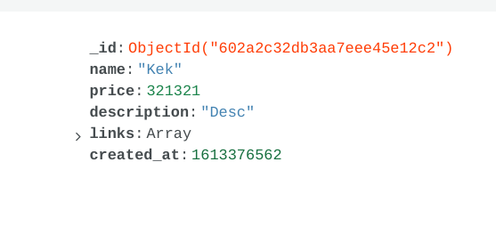

# GO API for Avito Advertising  
## This is HTTP JSON API made with Go lang  
## Methods:  
- **Add a new advertisement to the base**  
- **Get Page with 10 advertisement**  
- **Get particular advertisement by its ID**  
  

## Description of methods
- `/add_advertisement  POST`  
Takes `JSON description` of an advertisement and returns new `ID` from the database   
  Example:  
  ```
  {
      "_id": "Advertisement id",
      "name": "Advertisement name",
      "price": 2000,
      "description": "Description Text",
      "links": ["first link", "second link", "third link"]
  }
  ```
- `/ads/{page_num}?sort={sort_parameter}?direction={sort_direction}  GET`    
Gets a page with 10 advertisements by its number.  
  Sorts advertisements by `sort_parameter`(`price` or `time`) which should be specified in a query  
  `direction` is `desc` by default but could be changed to `asc`  
  `page_num` - pagination parameter, `int`  
  Query: `/ads/1?sort=time`  
  This query would return the first page with ads from latest to oldest advertisements  
  Example of a result:  
 ```
 [
     {
          "_id": "First Advertisement id",
          "name": "First Advertisement name",
          "price": 2000,
          "description": "First Advertisement Description Text",
          "links": ["first link", "second link", "third link"]
     }, 
     {
          "_id": "Second Advertisement id",
          "name": "Second Advertisement name",
          "price": 2000,
          "description": "Second Advertisement Description Text",
          "links": ["first link", "second link", "third link"]
     }, 
     ...

 ]
 ```  
- `/advertisement/{id}  GET`  
Gets information about advertisement by its ID   
Example of a result:
```
{
    "_id": "Advertisement id",
    "name": "Advertisement name",
    "price": 2000,
    "description": "Description Text",
    "links": ["first link", "second link", "third link"]
}
```  
## Technologies used  
- Go lang  
- MongoDb  
- Docker
- gorilla/mux router  

## Docker  
Project could be built by running `docker-compose up` and it uses port `5000` but the port could be changer in Environment Variables

### Example of data in MongoDb  



  